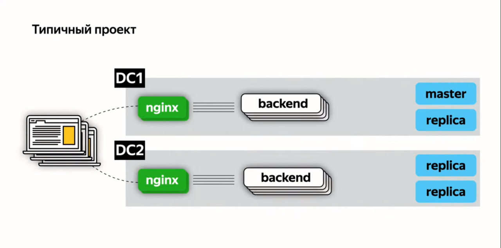
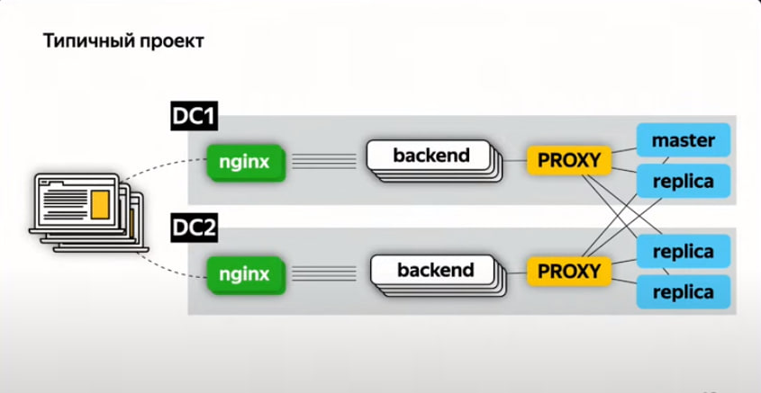
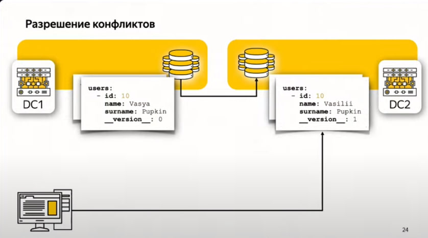
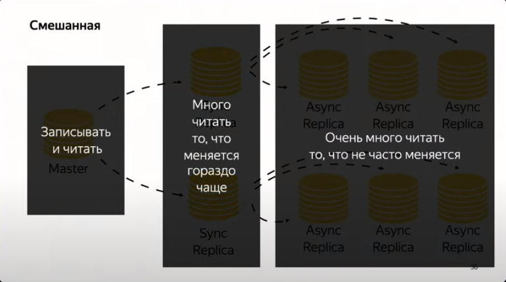

# Архитектура распределённых систем
## Что такое бэкенд
* То, что не видно пользователю напрямую
* Работает где-то далеко
* Если это требуется, то умеет обрабатывать много запросов одновременно

### Планирование нагрузки
Самое главное - и первое, что мы делаем при проектировании бэкенда - узнать, на какие нагрузки система будет рассчитана. От этого зависит многое: выбор технологий и методов разработки.  

"**Серебряной пули не бывает**", т.е. не существует какого-то оптимального решения. У каждого технического решения есть своя цена (время? деньги? и то и другое?)

### Требования к надёжности
* **Регламентирована доступность**  
Есть чёткие правила, когда система работает, когда не работает. Чаще всего, конечно, хочется, чтобы работала постоянно, но такое редко достигается
* **Спланирована нагрузка**  

### SLA (Service Level Agreement)
Это соглашение описывает качество услуг в заданный период (день, месяц, или год). В бэкенде это самое качество обычно измеряют количеством "девяток":

Все целятся в 6+ девяток, но, конечно, мало кому удается...  

Проблемы с надежностью заключаются, собственно, в том, что она зависит не только от нашего умения программировать, но от надёжности **каждого из компонентов** нашей системы.  

Примерно так может выглядеть пример какого-то бэкенда (с фронтендом в виде `Nginx`, с балансировщиками и прочими радостями)

Если добавим какую-то прокси для того, чтобы не убивать мастер-инстанс бд бешеными нагрузками, будет ещё лучше:

*Вот так должен выглядеть идеальный бэкенд. Запомните эту схему - её у вас достигнуть не получится, но к ней надо стремиться* (с)  

## CAP Теорема
Известна также как теорема Брюера. Утверждает, что в *любой* модели распределённых вычислений можно обеспечить **не более** двух из трёх свойств:  
* **C**onsistency - во всех вычислительных узлах в любой момент времени данные не противоречат друг другу  
* **A**vailability - любой запрос к распределённой система завершается корректным откликом (впрочем, не гарантируется, что ответы разных узлов совпадают)  
* **P**artition tolerance - устойчивость к разделению, т.е. расщепление распределённой системы на несколько нод не приводит к некорректности отклика какой-то из нод (а в более простой формулировке, это значит, что даунтайм одной из нод не влечёт за собой даунтайм всей системы)

### CP-система
Представим себе систему из $n$ нод (всё красиво работает, всё разделено, данные согласованы).  
И тут случается (не)предвиденное - одна из нод отказывает.   
Да, остальные всё ещё отвечают на запросы, и вроде бы всё ок, но.. когда отказавшая нода возвращается "в строй", оказывается, что данные во всех нодах неконсистентны - их нужно перебалансировывать, а значит, страдает доступность.  
### AP-система
Пусть опять есть невезучая отказавшая нода, она опять чинится, и вроде бы всё опять норм, но...  
Есть какой-то пользовательский запрос, и все ноды, кроме пострадавшей, ответят на него одно, а отказавшая - другое. Вот такие дела - консистентности нет.  

### CA-система
А вот такой системы в принципе не существует.  
Рассмотрим всё тот же сценарий с отказавшей нодой. За время даунтайма она, конечно, никак не могла понять, что состояния других нод изменились, поэтому консистентность достигается тогда и только тогда, когда в такой ситуации мы выключаем всю систему и синхронизируем данные.  

**Вывод: распределённая система либо всегда доступна, либо всегда консистентна - и то и другое одновременно недостижимо.**

## Согласованность в конечном счётё (eventual consistency)
Это модель согласованности, использующаяся в распределённых системах для достижения высокой доступности: в ёё рамках гарантируется, что **при отсутствии изменения данных, через какой-то промежуток времени (в конечном счётё) любой запрос в любую ноду будет возвращать корректное значение**, т.е. согласованность будет восстановлена.  

Если мы такое хотим, нам нужна какая-то умная автоматика, которая при даунтайме некоторых нод умеет как-то хитро восстанавливать консистентность. Например, каким-то версионированием, как на скриншоте ниже (при восстановлении связи между дата-центрами можно синхронизироваться, используя эти версии)

## Распределённые СУБД
PostgreSQL, например - классическая CP-система.  
MongoDB - AP-система.  

### Репликация
Вкратце: держим несколько копий базы данных.  
Оптимальный вариант репликации - что-то такое

Если у нас есть только *sync-реплики*, мы будем очень сильно проседать по скорости (надо сходить в каждую, получить от неё ОК, и уже потом ответить клиенту), к тому же отказ любой реплики влечёт за собой отказ всей системы.  
Полностью жить на *async-репликах* тоже не очень хорошо - всё же существует *replication lag*, который может приводить к не очень хорошим ситуациям.

### Партицирование
Допустим, хочется как-то разбить нашу огромную бд на $n$ кусочков (возможно, по географическому признаку). В какую партицию отправлять очередной запрос, может определять как клиент, так и сервер бд (тут у всех по разному). Идея очень простая, единственная проблема - как добавить в существующую систему новую партицию. Тут могут быть нюансы, которые зависят от конкретной бд, поэтому нужно **очень внимательно** изучить всё, что по этому поводу говорят в документации той бд, которую мы используем.

## 8 заблуждений в архитектуре распределённых систем

### 1. Сеть надёжна
Это просто неправда. К тому же нужно помнить, что если мы ходим в какие-то внешние источники (а они ходят ещё в какие-то свои источники), то их взаимодействие с сетью мы уж точно никак не контролируем.  
**Вывод: нужно аккуратно обрабатывать сетевые ошибки и таймауты**

### 2. Задержка равна 0
Это тоже не так, особенно, если речь не про простой round-trip внутри одного датацентра.  
**Вывод**:
1. нельзя привязывать бизнес-логику ко времени выполнения операции
2. переносим данные ближе к клиентам (географически)
3. иногда лучше возвращать больше информации (минимизировать кол-во запросов), всю информацию, которая понадобится
4. Инвертировать поток (publish/subcribe со стороны клиента)

### 3. Канал передачи очень широкий
Трафик не резиновый и передаётся не моментально.  
**Вывод: передаём то и только то, что нужно, используем сжатие.**

### 4. Cеть безопасна
Внутри одного датацентра - возможно. Когда выходим за его пределы - мы **должны** использовать TLS/SSL

### 5. Топология сети неизменна
Ретраи не должны ломать нашу логику. Нужно обеспечивать атомарность и идемпотентность API

### 6. Есть один администратор
20 лет назад, возможно, так и было. Сейчас про инфру должны думать все, причём тщательно

### 7. Транспортные расходы равны 0
Трафик тоже стоит денег.  
Хорошие практики:
* Экономия трафика
* Контроль входящего/исходящего трафика. Если у нас исходящего трафика внезапно стало непропорционально больше, чем входящего, что-то явно идёт не так - возможно, нас вообще взломали и выкачивают все, до чего руки дотягиваются

### 8. Сеть гомогенна
Конечно, нет. Стоит думать о том, что видит клиент, теряющий некоторый процент сетевых пакетов.

Ещё насчёт идемпотентности: в сервисно-ориентированной архитектуре есть понятие *ключ идемпотентности* - некий идентификатор, приходящий вместе с запросом, и позволяющий серверу понять, что запрос этот уже был и мы должны были на него ответить.  

## Про кеширование
Кеширование бывает разное:
* На стороне клиента: HTTP + Cache-Control, например
* На стороне инфраструктуры (наш прокси-nginx тоже может что-то кешировать)
* На стороне бэкенда (Redis/Memcache)

Кешировать нужно с умом, потому что инвалидация кеша - наша забота. Поэтому кешировать лучше те запросы, которых много (какие-то статические странички, etc.)

Конечно, инвали*Д*ация :)
